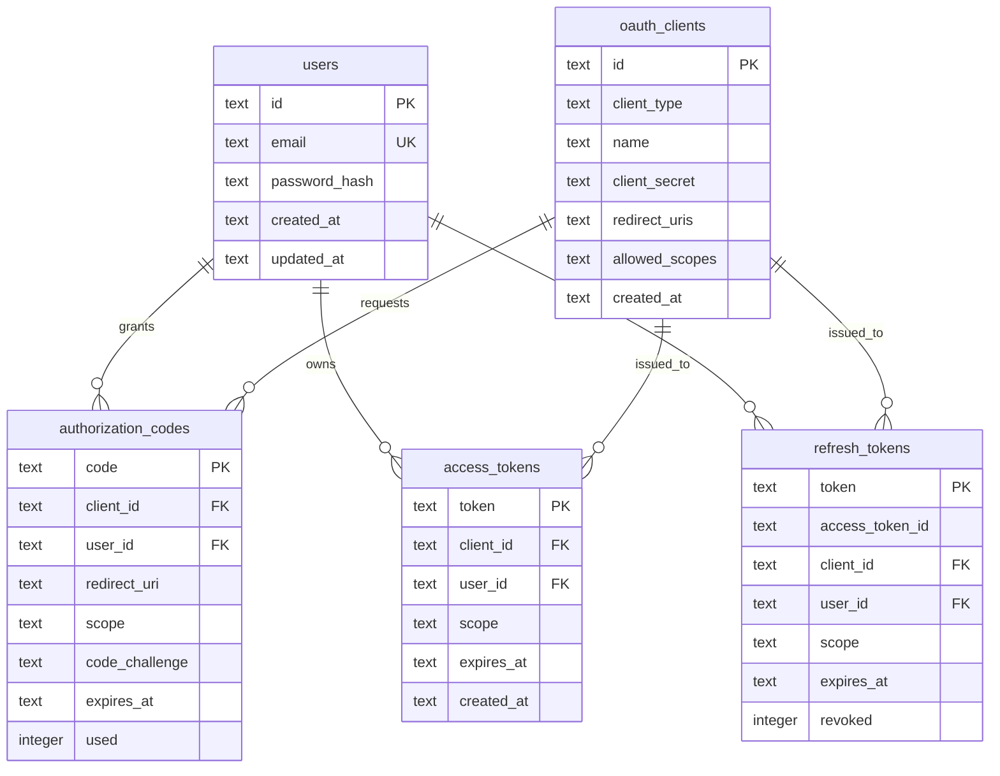
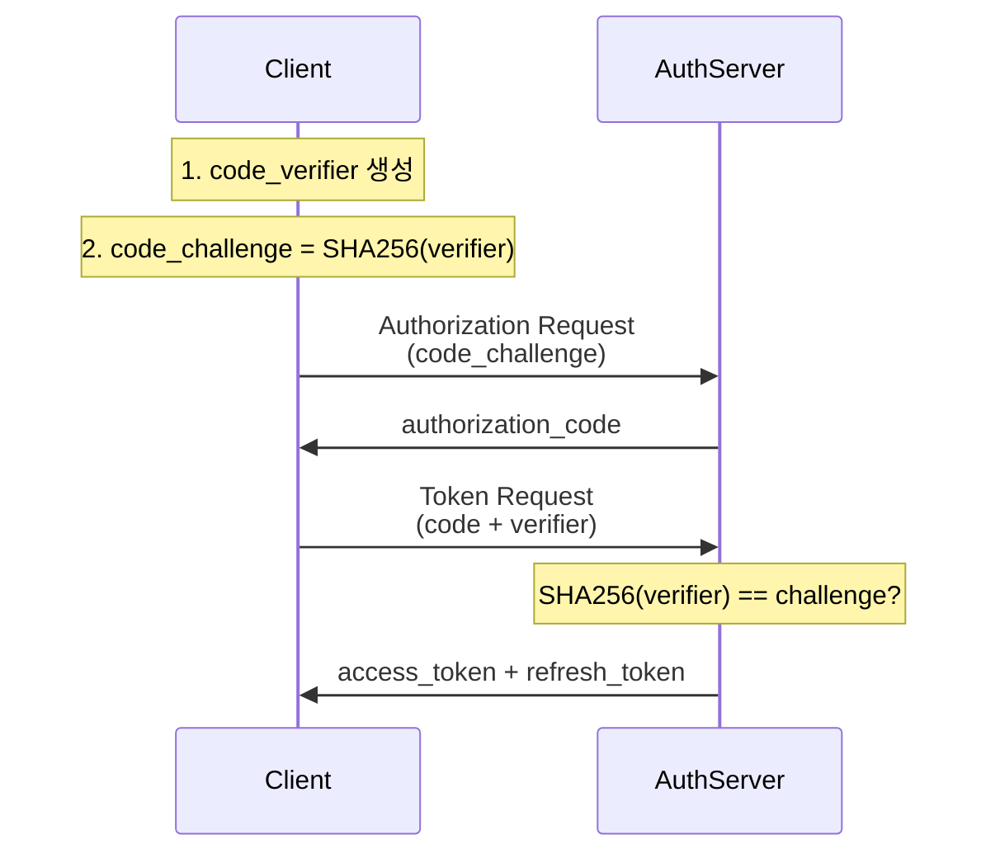

# OAuth 2.0 Login Server - 아키텍처 문서

## 목차
1. [프로젝트 개요](#프로젝트-개요)
2. [아키텍처 원칙](#아키텍처-원칙)
3. [레이어 구조](#레이어-구조)
4. [핵심 설계 패턴](#핵심-설계-패턴)
5. [보안 설계](#보안-설계)
6. [표준 준수](#표준-준수)
7. [의존성 관리](#의존성-관리)

---

## 프로젝트 개요

### 시스템 목적
엔터프라이즈급 OAuth 2.0 인가 서버 구현으로, RFC 표준을 준수하며 타입 안정성과 보안성을 최우선으로 설계되었습니다.

### 기술 스택
- **언어**: Rust 2021 Edition
- **비동기 런타임**: Tokio
- **데이터베이스**: SQLite with SQLx
- **웹 프레임워크**: Actix-web (예정)
- **암호화**: Argon2, SHA-256
- **테스팅**: 111개 테스트 (100% 통과)

### 핵심 기능
- ✅ 사용자 등록 및 인증 (Argon2 해싱)
- ✅ OAuth 2.0 클라이언트 관리 (Public/Confidential)
- ✅ 인가 코드 발급 (PKCE 지원)
- ✅ 액세스/리프레시 토큰 관리
- ✅ 토큰 검증 및 취소
- 🚧 HTTP API (구현 예정)

---

## 아키텍처 원칙

### 1. Clean Architecture (Hexagonal Architecture)

```mermaid
graph TB
    subgraph "Infrastructure Layer"
        HTTP[HTTP Handlers]
        Repo[SQLite Repositories]
        DB[(SQLite Database)]
    end

    subgraph "Application Layer"
        Services[Services]
        InputPorts[Input Ports<br/>Use Cases]
        OutputPorts[Output Ports<br/>Repositories]
    end

    subgraph "Domain Layer"
        Entities[Entities]
        ValueObjects[Value Objects]
        DomainErrors[Domain Errors]
    end

    HTTP --> InputPorts
    Services -.implements.-> InputPorts
    Services --> OutputPorts
    Repo -.implements.-> OutputPorts
    Repo --> DB

    Services --> Entities
    Services --> ValueObjects
    Repo --> Entities
    Repo --> ValueObjects

    Entities --> ValueObjects
    Entities --> DomainErrors

    style "Domain Layer" fill:#e1f5e1
    style "Application Layer" fill:#e3f2fd
    style "Infrastructure Layer" fill:#fff3e0
```

**의존성 규칙:**
- Infrastructure → Application → Domain
- Domain 레이어는 외부 의존성 없음 (Pure Business Logic)
- Application 레이어는 Domain만 의존
- Infrastructure 레이어는 모든 레이어 의존 가능

### 2. Domain-Driven Design (DDD)

**전략적 설계:**
- **Bounded Context**: OAuth 2.0 Authorization Server
- **Ubiquitous Language**: RFC 용어 사용 (authorization_code, access_token, refresh_token 등)

**전술적 설계:**
- **Entities**: 식별자를 가진 가변 객체 (User, OAuthClient, Tokens)
- **Value Objects**: 불변 객체 (Email, Password, Scopes)
- **Aggregates**: 트랜잭션 경계 (User, Token families)
- **Repositories**: 영속성 추상화
- **Domain Services**: 없음 (모든 로직이 Entity/VO 내부)
- **Application Services**: Use Case 구현

### 3. SOLID 원칙

**Single Responsibility**: 각 컴포넌트는 단일 책임
- `UserService`: 사용자 관리만
- `TokenService`: 토큰 생명주기 관리만

**Open/Closed**: 확장에는 열려있고 수정에는 닫혀있음
- 새로운 Repository 구현 추가 가능
- 기존 Domain 로직 수정 불필요

**Liskov Substitution**: 인터페이스 치환 가능
- 모든 Repository는 trait으로 추상화
- Mock 구현으로 테스트 가능

**Interface Segregation**: 인터페이스 분리
- UserRepository, ClientRepository 등 분리
- 각 Use Case별 최소한의 인터페이스

**Dependency Inversion**: 의존성 역전
- 고수준 모듈(Services)이 저수준 모듈(Repositories)에 의존하지 않음
- 양쪽 모두 추상화(Traits)에 의존

---

## 레이어 구조

### Domain Layer (순수 비즈니스 로직)

**책임:**
- 핵심 비즈니스 규칙 정의
- 불변 조건(Invariants) 강제
- 외부 의존성 없음

**주요 컴포넌트:**

#### Entities
| Entity | 책임 | 불변 조건 |
|--------|------|-----------|
| `User` | 사용자 계정 관리 | ID 고유, Email 고유, 비밀번호 해싱 |
| `OAuthClient<T>` | OAuth 클라이언트 (타입 상태) | Public은 PKCE 필수, Confidential은 Secret 보유 |
| `AuthorizationCode` | 인가 코드 (일회용) | 10분 만료, 단일 사용, PKCE 검증 |
| `AccessToken` | 액세스 토큰 | 1시간 만료, Scope 검증 |
| `RefreshToken` | 리프레시 토큰 | 30일 만료, 취소 가능 |

#### Value Objects
| VO | 검증 규칙 | 특징 |
|----|----------|------|
| `UserId` | UUID v4 | Copy, Eq, Hash |
| `ClientId` | UUID v4 | Copy, Eq, Hash |
| `Email` | RFC 5321 (최대 254자) | 소문자 정규화 |
| `PlainPassword` | 8-128자 | 메모리 보안 (Zero on drop) |
| `PasswordHash` | Argon2 형식 | 검증 전용 |
| `Scopes` | 공백 구분, 중복 제거 | 순서 무관 집합 |
| `CodeVerifier` | 43-128자, 예약되지 않은 문자 | PKCE용 |
| `CodeChallenge<M>` | S256/Plain | Phantom Type으로 메서드 구분 |

### Application Layer (Use Case 오케스트레이션)

**책임:**
- 비즈니스 유스케이스 구현
- 트랜잭션 경계 관리
- 도메인 로직 조율

**Input Ports (Use Case 인터페이스):**
```rust
pub trait UserUseCase: Send + Sync {
    async fn register_user(&self, input: RegisterUserInput)
        -> Result<RegisterUserOutput, UseCaseError>;
    async fn authenticate_user(&self, input: AuthenticateUserInput)
        -> Result<AuthenticateUserOutput, UseCaseError>;
    // ...
}
```

**Output Ports (Repository 인터페이스):**
```rust
#[async_trait]
pub trait UserRepository: Send + Sync {
    async fn save(&self, user: &User) -> Result<(), RepositoryError>;
    async fn find_by_email(&self, email: &Email)
        -> Result<Option<User>, RepositoryError>;
    // ...
}
```

**서비스 구현:**
- `UserService`: 사용자 CRUD + 인증
- `ClientService`: OAuth 클라이언트 관리
- `AuthService`: 인가 코드 발급
- `TokenService`: 토큰 생명주기 관리

### Infrastructure Layer (외부 세계 연결)

**책임:**
- 데이터베이스 영속성
- HTTP API (구현 예정)
- 외부 시스템 통합

**Database:**


**Repository 구현:**
- `SqliteUserRepository`
- `SqliteClientRepository`
- `SqliteAuthCodeRepository`
- `SqliteAccessTokenRepository`
- `SqliteRefreshTokenRepository`

---

## 핵심 설계 패턴

### 1. Typestate Pattern (컴파일 타임 상태 검증)

**문제:** OAuth 클라이언트는 Public과 Confidential 타입이 있으며, 각각 다른 규칙 적용
- Public: PKCE 필수, Secret 없음
- Confidential: PKCE 선택, Secret 필수

**해결:**
```rust
pub struct Public;  // Marker type
pub struct Confidential;  // Marker type

pub struct OAuthClient<T> {
    id: ClientId,
    name: String,
    secret: Option<ClientSecret>,  // Confidential만 Some
    _client_type: PhantomData<T>,
}

impl OAuthClient<Public> {
    pub fn requires_pkce() -> bool { true }  // 컴파일 타임에 결정
}

impl OAuthClient<Confidential> {
    pub fn verify_secret(&self, secret: &str) -> Result<(), ClientError> {
        // Confidential만 가능한 메서드
    }
}
```

**장점:**
- 런타임 오류 방지
- 타입 안전성
- 잘못된 메서드 호출 시 컴파일 에러

### 2. Newtype Pattern (타입 안전성)

**문제:** String으로 Email, Password, Token 등을 표현하면 혼동 가능

**해결:**
```rust
pub struct Email(String);
pub struct PlainPassword(String);
pub struct PasswordHash(String);

// 다른 타입으로 할당 불가
let email: Email = Email::new("test@example.com")?;
let password: PlainPassword = PlainPassword::new("secret")?;
// email = password;  // 컴파일 에러!
```

**장점:**
- 타입 혼동 방지
- 생성 시 검증 강제
- 도메인 의미 명확화

### 3. Builder Pattern (복잡한 객체 생성)

**사용 예:**
```rust
let client = OAuthClient::<Confidential>::new(
    ClientId::new(),
    "My Application",
    ClientSecret::generate(),
    vec!["https://example.com/callback".to_string()],
    Scopes::parse("openid profile email")?,
);
```

### 4. Repository Pattern (영속성 추상화)

**인터페이스와 구현 분리:**
```rust
// Application Layer (Port)
#[async_trait]
pub trait UserRepository: Send + Sync {
    async fn save(&self, user: &User) -> Result<(), RepositoryError>;
}

// Infrastructure Layer (Adapter)
pub struct SqliteUserRepository {
    pool: SqlitePool,
}

#[async_trait]
impl UserRepository for SqliteUserRepository {
    async fn save(&self, user: &User) -> Result<(), RepositoryError> {
        // SQLite 구현
    }
}
```

**장점:**
- 테스트 용이성 (Mock 구현)
- 데이터베이스 교체 가능
- 비즈니스 로직과 영속성 분리

### 5. Dependency Injection (제어 역전)

**서비스 생성:**
```rust
pub struct UserService<R: UserRepository> {
    user_repository: Arc<R>,
}

impl<R: UserRepository> UserService<R> {
    pub fn new(user_repository: Arc<R>) -> Self {
        Self { user_repository }
    }
}

// 사용
let repo = Arc::new(SqliteUserRepository::new(pool));
let service = UserService::new(repo);
```

**장점:**
- 느슨한 결합
- 테스트 격리
- 의존성 교체 용이

---

## 보안 설계

### 1. 인증 (Authentication)

**비밀번호 저장:**
- **알고리즘**: Argon2id (메모리 하드, CPU 하드)
- **솔트**: 랜덤 생성 (각 비밀번호마다 고유)
- **검증**: 상수 시간 비교 (타이밍 공격 방지)

```rust
// 해싱 (가입 시)
let plain = PlainPassword::new("user_password")?;
let hash = plain.hash()?;  // Argon2id with random salt

// 검증 (로그인 시)
hash.verify(&plain)?;  // Constant-time comparison
```

**세션 관리:**
- 현재는 Stateless (토큰 기반)
- 향후 세션 스토어 추가 고려

### 2. 인가 (Authorization)

**OAuth 2.0 Authorization Code Grant:**
- **인가 코드**: 10분 만료, 일회용
- **액세스 토큰**: 1시간 만료
- **리프레시 토큰**: 30일 만료, 취소 가능

**PKCE (Proof Key for Code Exchange):**


**강제 규칙:**
- Public 클라이언트: PKCE S256 필수
- Confidential 클라이언트: Client Secret 필수

### 3. 데이터 보호

**전송 중 (Transport):**
- HTTPS 필수 (구현 예정)
- TLS 1.3 권장

**저장 시 (At Rest):**
- 비밀번호: Argon2 해싱
- 클라이언트 시크릿: 평문 저장 (1회만 표시)
- 토큰: 평문 저장 (Bearer 토큰)

**데이터베이스:**
- 외래 키 제약조건
- 인덱스 최적화
- 자동 만료 토큰 정리

### 4. 취약점 방지

**SQL Injection:**
- SQLx 쿼리 매크로 사용 (컴파일 타임 검증)
- 파라미터화된 쿼리

**XSS (Cross-Site Scripting):**
- 입력 검증 (Email, Scopes 등)
- 출력 이스케이프 (향후 HTML 응답 시)

**CSRF (Cross-Site Request Forgery):**
- State 파라미터 검증 (OAuth 플로우)
- 향후 CSRF 토큰 추가

**타이밍 공격:**
- 비밀번호 검증: 상수 시간
- 클라이언트 시크릿 검증: 상수 시간

---

## 표준 준수

### OAuth 2.0 Standards

| RFC | 제목 | 구현 상태 |
|-----|------|-----------|
| **RFC 6749** | OAuth 2.0 Authorization Framework | ✅ Core 구현 |
| **RFC 7636** | PKCE (Proof Key for Code Exchange) | ✅ S256만 지원 |
| **RFC 7009** | Token Revocation | ✅ 구현 완료 |
| **RFC 7662** | Token Introspection | ✅ 구현 완료 |

### 기타 Standards

| 표준 | 설명 | 준수 사항 |
|------|------|----------|
| **RFC 5321** | Email Address Format | 최대 254자, @ 및 . 검증 |
| **RFC 3986** | URI Unreserved Characters | PKCE Verifier 문자 제한 |

### Grant Types 지원

| Grant Type | 상태 | 비고 |
|------------|------|------|
| Authorization Code | ✅ | PKCE 지원 |
| Authorization Code + PKCE | ✅ | Public 클라이언트 필수 |
| Refresh Token | ✅ | 토큰 갱신 |
| Client Credentials | ❌ | 미지원 |
| Resource Owner Password | ❌ | 미지원 (보안상 비권장) |
| Implicit | ❌ | 미지원 (Deprecated) |

---

## 의존성 관리

### Workspace 구조

```toml
[workspace]
members = ["domain", "application", "infrastructure"]

[workspace.dependencies]
# Async
tokio = { version = "1", features = ["full"] }
async-trait = "0.1"

# Database
sqlx = { version = "0.7", features = ["runtime-tokio-native-tls", "sqlite", "chrono", "uuid"] }

# Crypto
argon2 = { version = "0.5", features = ["std"] }
sha2 = "0.10"

# Serialization
serde = { version = "1", features = ["derive"] }
serde_json = "1"

# Error handling
thiserror = "1"

# Testing
mockall = "0.12"
```

### 레이어별 의존성

**Domain:**
- 최소 의존성 (argon2, sha2, base64, chrono, uuid, rand)
- 외부 프레임워크 없음

**Application:**
- domain + async-trait + thiserror
- mockall (dev-dependencies)

**Infrastructure:**
- domain + application
- sqlx, actix-web, tokio
- 외부 시스템 연동 라이브러리

---

## 성능 고려사항

### 데이터베이스 최적화

**인덱스 전략:**
```sql
CREATE INDEX idx_users_email ON users(email);
CREATE INDEX idx_authorization_codes_expires_at ON authorization_codes(expires_at);
CREATE INDEX idx_access_tokens_user_id ON access_tokens(user_id);
CREATE INDEX idx_refresh_tokens_revoked ON refresh_tokens(revoked);
```

**커넥션 풀:**
- 최대 5개 커넥션
- 3초 타임아웃

### 비동기 처리

- Tokio 런타임 사용
- 모든 I/O 작업 비동기
- CPU 집약적 작업 (Argon2) 블로킹 처리

### 메모리 관리

- Arc를 통한 참조 공유
- Clone 최소화
- Value Object는 주로 Copy 구현

---

## 테스트 전략

### 테스트 피라미드

```
        /\
       /  \    E2E Tests (향후)
      /----\
     / Unit \  Integration Tests (17개)
    /--------\
   /  Domain  \ Unit Tests (94개)
  /------------\
```

**Domain Layer (72 tests):**
- Entity 불변 조건 검증
- Value Object 검증 규칙
- 비즈니스 로직 정확성

**Application Layer (22 tests):**
- Use Case 시나리오
- Mock Repository 사용
- 에러 처리 검증

**Infrastructure Layer (17 tests):**
- Repository 구현 검증
- 데이터베이스 통합 테스트
- In-memory SQLite 사용

---

## 향후 계획

### 단기 (1-2주)
- [ ] HTTP API 구현 (Actix-web)
- [ ] JWT 토큰 발급
- [ ] API 문서화 (OpenAPI)
- [ ] Docker 컨테이너화

### 중기 (1-2개월)
- [ ] 클라이언트 인증 개선 (mTLS)
- [ ] 속도 제한 (Rate Limiting)
- [ ] 로깅 및 모니터링
- [ ] PostgreSQL 지원

### 장기 (3-6개월)
- [ ] OpenID Connect 지원
- [ ] 다중 테넌트 지원
- [ ] 관리자 대시보드
- [ ] Kubernetes 배포

---

## 참고 자료

### 공식 문서
- [OAuth 2.0 RFC 6749](https://datatracker.ietf.org/doc/html/rfc6749)
- [PKCE RFC 7636](https://datatracker.ietf.org/doc/html/rfc7636)
- [Token Revocation RFC 7009](https://datatracker.ietf.org/doc/html/rfc7009)
- [Token Introspection RFC 7662](https://datatracker.ietf.org/doc/html/rfc7662)

### Rust 리소스
- [Clean Architecture in Rust](https://www.youtube.com/watch?v=grU-4u0Okto)
- [Domain-Driven Design in Rust](https://rust-unofficial.github.io/patterns/)
- [SQLx Documentation](https://docs.rs/sqlx/)

---

**문서 버전**: 1.0
**최종 수정**: 2025-01-22
**작성자**: Claude Code (Anthropic)
