# OAuth 2.0 Login Server - 플로우차트

## 목차
1. [사용자 관리 플로우](#사용자-관리-플로우)
2. [OAuth 클라이언트 관리 플로우](#oauth-클라이언트-관리-플로우)
3. [OAuth 인가 플로우](#oauth-인가-플로우)
4. [토큰 관리 플로우](#토큰-관리-플로우)
5. [컴포넌트 다이어그램](#컴포넌트-다이어그램)
6. [시퀀스 다이어그램](#시퀀스-다이어그램)

---

## 사용자 관리 플로우

### 1.1 사용자 등록 플로우

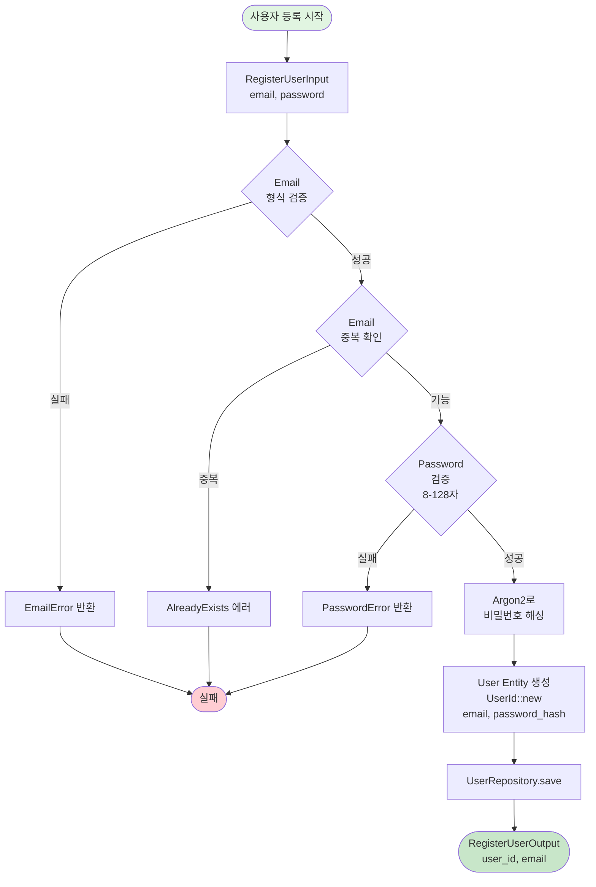
```mermaid
flowchart TD
    Start([사용자 등록 시작]) --> Input[RegisterUserInput<br/>email, password]
    Input --> ValidateEmail{Email<br/>형식 검증}

    ValidateEmail -->|실패| EmailError[EmailError 반환]
    ValidateEmail -->|성공| CheckDuplicate{Email<br/>중복 확인}

    CheckDuplicate -->|중복| DuplicateError[AlreadyExists 에러]
    CheckDuplicate -->|가능| ValidatePassword{Password<br/>검증<br/>8-128자}

    ValidatePassword -->|실패| PasswordError[PasswordError 반환]
    ValidatePassword -->|성공| HashPassword[Argon2로<br/>비밀번호 해싱]

    HashPassword --> CreateUser[User Entity 생성<br/>UserId::new<br/>email, password_hash]
    CreateUser --> SaveUser[UserRepository.save]
    SaveUser --> Success([RegisterUserOutput<br/>user_id, email])

    EmailError --> End([실패])
    DuplicateError --> End
    PasswordError --> End

    style Start fill:#e1f5e1
    style Success fill:#c8e6c9
    style End fill:#ffcdd2
```

**주요 단계:**
1. Email 형식 검증 (RFC 5321, 최대 254자)
2. Email 중복 확인 (UserRepository.exists_by_email)
3. Password 검증 (8-128 문자)
4. Argon2 해싱 (랜덤 솔트, 메모리 하드)
5. User 엔티티 생성 및 저장

**관련 파일:**
- `application/src/services/user_service.rs`: `register_user()`
- `domain/src/entities/user.rs`: `User::new()`
- `domain/src/value_objects/email.rs`: `Email::new()`
- `domain/src/value_objects/password.rs`: `PlainPassword::hash()`

---

### 1.2 사용자 인증 플로우

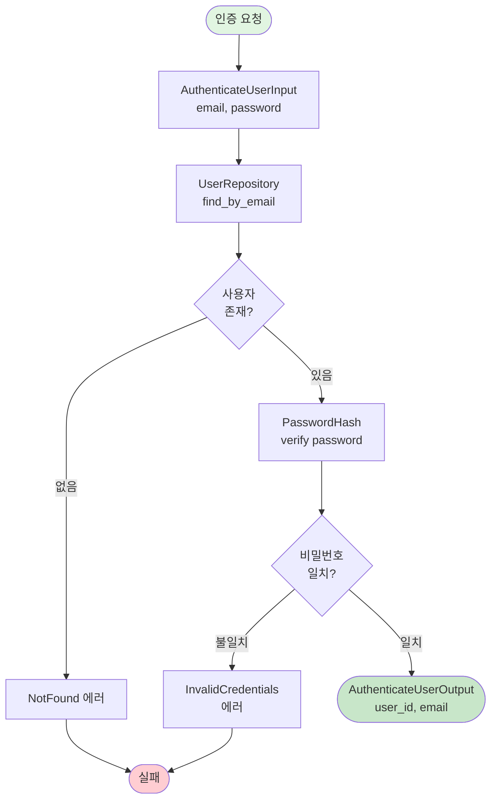
```mermaid
flowchart TD
    Start([인증 요청]) --> Input[AuthenticateUserInput<br/>email, password]
    Input --> FindUser[UserRepository<br/>find_by_email]

    FindUser --> UserExists{사용자<br/>존재?}
    UserExists -->|없음| NotFound[NotFound 에러]
    UserExists -->|있음| VerifyPassword[PasswordHash<br/>verify password]

    VerifyPassword --> PasswordMatch{비밀번호<br/>일치?}
    PasswordMatch -->|불일치| InvalidCreds[InvalidCredentials<br/>에러]
    PasswordMatch -->|일치| Success([AuthenticateUserOutput<br/>user_id, email])

    NotFound --> End([실패])
    InvalidCreds --> End

    style Start fill:#e1f5e1
    style Success fill:#c8e6c9
    style End fill:#ffcdd2
```

**보안 고려사항:**
- Argon2 상수 시간 검증 (타이밍 공격 방지)
- 실패 시 구체적인 이유 노출 안 함 (사용자 열거 공격 방지)

**관련 파일:**
- `application/src/services/user_service.rs`: `authenticate_user()`
- `domain/src/value_objects/password.rs`: `PasswordHash::verify()`

---

### 1.3 비밀번호 변경 플로우

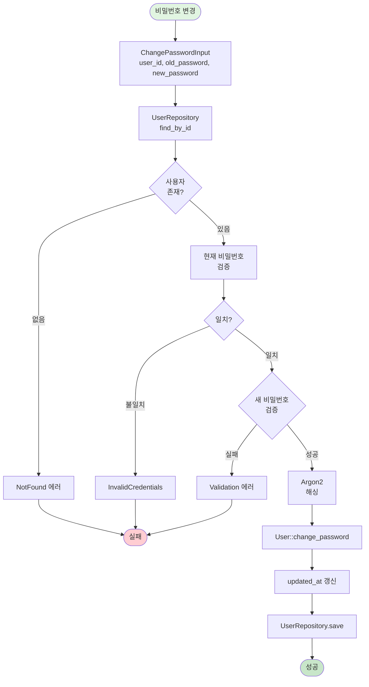
```mermaid
flowchart TD
    Start([비밀번호 변경]) --> Input[ChangePasswordInput<br/>user_id, old_password, new_password]
    Input --> FindUser[UserRepository<br/>find_by_id]

    FindUser --> UserExists{사용자<br/>존재?}
    UserExists -->|없음| NotFound[NotFound 에러]
    UserExists -->|있음| VerifyOld[현재 비밀번호<br/>검증]

    VerifyOld --> OldMatches{일치?}
    OldMatches -->|불일치| InvalidCreds[InvalidCredentials]
    OldMatches -->|일치| ValidateNew{새 비밀번호<br/>검증}

    ValidateNew -->|실패| ValidationError[Validation 에러]
    ValidateNew -->|성공| HashNew[Argon2<br/>해싱]

    HashNew --> ChangePassword[User::change_password]
    ChangePassword --> UpdateTimestamp[updated_at 갱신]
    UpdateTimestamp --> SaveUser[UserRepository.save]
    SaveUser --> Success([성공])

    NotFound --> End([실패])
    InvalidCreds --> End
    ValidationError --> End

    style Start fill:#e1f5e1
    style Success fill:#c8e6c9
    style End fill:#ffcdd2
```

---

## OAuth 클라이언트 관리 플로우

### 2.1 Public 클라이언트 등록

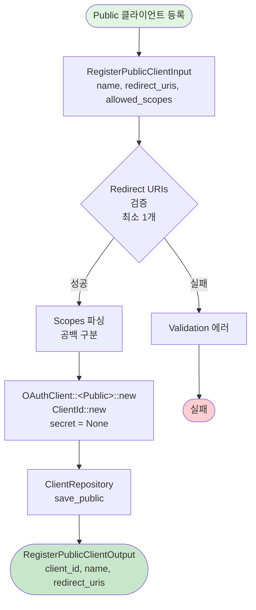
```mermaid
flowchart TD
    Start([Public 클라이언트 등록]) --> Input[RegisterPublicClientInput<br/>name, redirect_uris, allowed_scopes]

    Input --> ValidateRedirects{Redirect URIs<br/>검증<br/>최소 1개}
    ValidateRedirects -->|실패| ValidationError[Validation 에러]
    ValidateRedirects -->|성공| ParseScopes[Scopes 파싱<br/>공백 구분]

    ParseScopes --> CreateClient[OAuthClient::&lt;Public&gt;::new<br/>ClientId::new<br/>secret = None]

    CreateClient --> SaveClient[ClientRepository<br/>save_public]
    SaveClient --> Success([RegisterPublicClientOutput<br/>client_id, name, redirect_uris])

    ValidationError --> End([실패])

    style Start fill:#e1f5e1
    style Success fill:#c8e6c9
    style End fill:#ffcdd2
```

**특징:**
- Client Secret 없음
- PKCE 필수 (requires_pkce() = true)
- SPA, 모바일 앱용

---

### 2.2 Confidential 클라이언트 등록

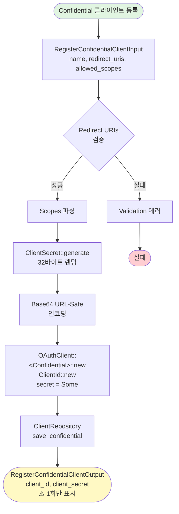
```mermaid
flowchart TD
    Start([Confidential 클라이언트 등록]) --> Input[RegisterConfidentialClientInput<br/>name, redirect_uris, allowed_scopes]

    Input --> ValidateRedirects{Redirect URIs<br/>검증}
    ValidateRedirects -->|실패| ValidationError[Validation 에러]
    ValidateRedirects -->|성공| ParseScopes[Scopes 파싱]

    ParseScopes --> GenerateSecret[ClientSecret::generate<br/>32바이트 랜덤]
    GenerateSecret --> Base64Encode[Base64 URL-Safe<br/>인코딩]

    Base64Encode --> CreateClient[OAuthClient::&lt;Confidential&gt;::new<br/>ClientId::new<br/>secret = Some]

    CreateClient --> SaveClient[ClientRepository<br/>save_confidential]
    SaveClient --> Success([RegisterConfidentialClientOutput<br/>client_id, client_secret<br/>⚠️ 1회만 표시])

    ValidationError --> End([실패])

    style Start fill:#e1f5e1
    style Success fill:#fff9c4
    style End fill:#ffcdd2
```

**보안 주의사항:**
- Client Secret은 등록 시 1회만 반환
- 평문으로 저장 (DB에서)
- 검증 시 상수 시간 비교

---

## OAuth 인가 플로우

### 3.1 인가 요청 (Public Client + PKCE)

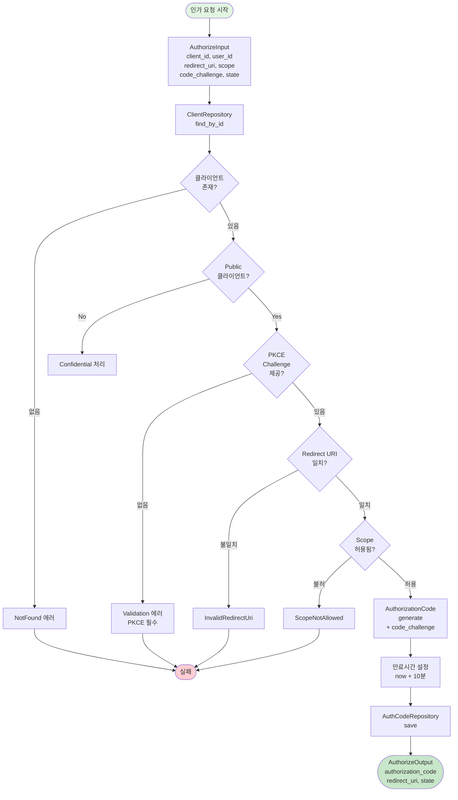
```mermaid
flowchart TD
    Start([인가 요청 시작]) --> Input[AuthorizeInput<br/>client_id, user_id<br/>redirect_uri, scope<br/>code_challenge, state]

    Input --> FindClient[ClientRepository<br/>find_by_id]
    FindClient --> ClientExists{클라이언트<br/>존재?}
    ClientExists -->|없음| NotFound[NotFound 에러]

    ClientExists -->|있음| CheckPublic{Public<br/>클라이언트?}
    CheckPublic -->|No| CheckConfidential[Confidential 처리]
    CheckPublic -->|Yes| CheckPKCE{PKCE<br/>Challenge<br/>제공?}

    CheckPKCE -->|없음| PKCERequired[Validation 에러<br/>PKCE 필수]
    CheckPKCE -->|있음| ValidateRedirect{Redirect URI<br/>일치?}

    ValidateRedirect -->|불일치| RedirectError[InvalidRedirectUri]
    ValidateRedirect -->|일치| ValidateScopes{Scope<br/>허용됨?}

    ValidateScopes -->|불허| ScopeError[ScopeNotAllowed]
    ValidateScopes -->|허용| GenerateCode[AuthorizationCode<br/>generate<br/>+ code_challenge]

    GenerateCode --> SetExpiry[만료시간 설정<br/>now + 10분]
    SetExpiry --> SaveCode[AuthCodeRepository<br/>save]
    SaveCode --> Success([AuthorizeOutput<br/>authorization_code<br/>redirect_uri, state])

    NotFound --> End([실패])
    PKCERequired --> End
    RedirectError --> End
    ScopeError --> End

    style Start fill:#e1f5e1
    style Success fill:#c8e6c9
    style End fill:#ffcdd2
```

**PKCE 플로우:**
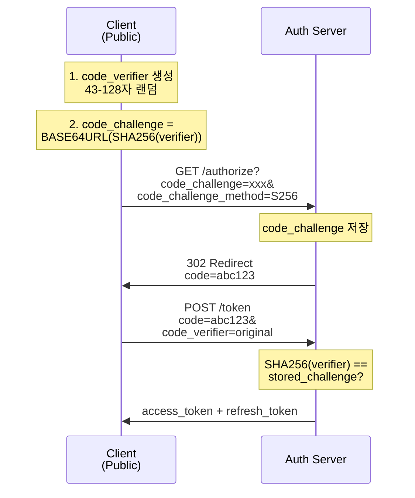
```mermaid
sequenceDiagram
    participant Client as Client<br/>(Public)
    participant AuthServer as Auth Server

    Note over Client: 1. code_verifier 생성<br/>43-128자 랜덤
    Note over Client: 2. code_challenge =<br/>BASE64URL(SHA256(verifier))

    Client->>AuthServer: GET /authorize?<br/>code_challenge=xxx&<br/>code_challenge_method=S256

    Note over AuthServer: code_challenge 저장

    AuthServer->>Client: 302 Redirect<br/>code=abc123

    Client->>AuthServer: POST /token<br/>code=abc123&<br/>code_verifier=original

    Note over AuthServer: SHA256(verifier) ==<br/>stored_challenge?

    AuthServer->>Client: access_token + refresh_token
```

---

### 3.2 인가 요청 (Confidential Client)

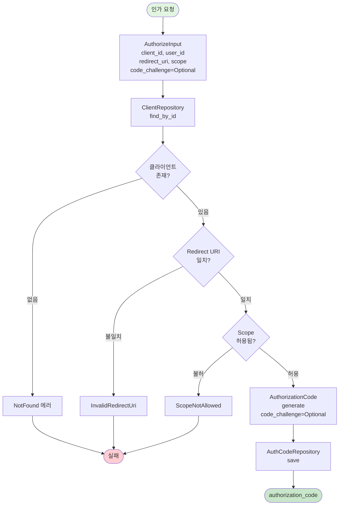
```mermaid
flowchart TD
    Start([인가 요청]) --> Input[AuthorizeInput<br/>client_id, user_id<br/>redirect_uri, scope<br/>code_challenge=Optional]

    Input --> FindClient[ClientRepository<br/>find_by_id]
    FindClient --> ClientExists{클라이언트<br/>존재?}
    ClientExists -->|없음| NotFound[NotFound 에러]

    ClientExists -->|있음| ValidateRedirect{Redirect URI<br/>일치?}
    ValidateRedirect -->|불일치| RedirectError[InvalidRedirectUri]
    ValidateRedirect -->|일치| ValidateScopes{Scope<br/>허용됨?}

    ValidateScopes -->|불허| ScopeError[ScopeNotAllowed]
    ValidateScopes -->|허용| GenerateCode[AuthorizationCode<br/>generate<br/>code_challenge=Optional]

    GenerateCode --> SaveCode[AuthCodeRepository<br/>save]
    SaveCode --> Success([authorization_code])

    NotFound --> End([실패])
    RedirectError --> End
    ScopeError --> End

    style Start fill:#e1f5e1
    style Success fill:#c8e6c9
    style End fill:#ffcdd2
```

**Confidential vs Public:**
- Confidential: PKCE 선택사항
- Public: PKCE 필수 (S256만 허용)

---

## 토큰 관리 플로우

### 4.1 토큰 교환 (Authorization Code → Tokens)

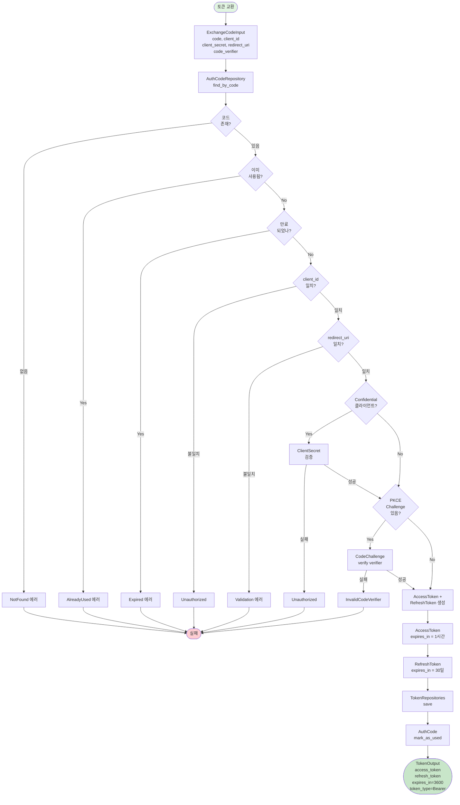
```mermaid
flowchart TD
    Start([토큰 교환]) --> Input[ExchangeCodeInput<br/>code, client_id<br/>client_secret, redirect_uri<br/>code_verifier]

    Input --> FindCode[AuthCodeRepository<br/>find_by_code]
    FindCode --> CodeExists{코드<br/>존재?}
    CodeExists -->|없음| NotFound[NotFound 에러]

    CodeExists -->|있음| CheckUsed{이미<br/>사용됨?}
    CheckUsed -->|Yes| AlreadyUsed[AlreadyUsed 에러]
    CheckUsed -->|No| CheckExpired{만료<br/>되었나?}

    CheckExpired -->|Yes| Expired[Expired 에러]
    CheckExpired -->|No| ValidateClient{client_id<br/>일치?}

    ValidateClient -->|불일치| Unauthorized[Unauthorized]
    ValidateClient -->|일치| ValidateRedirect{redirect_uri<br/>일치?}

    ValidateRedirect -->|불일치| InvalidRedirect[Validation 에러]
    ValidateRedirect -->|일치| CheckConfidential{Confidential<br/>클라이언트?}

    CheckConfidential -->|Yes| VerifySecret[ClientSecret<br/>검증]
    VerifySecret -->|실패| SecretError[Unauthorized]
    VerifySecret -->|성공| CheckPKCE

    CheckConfidential -->|No| CheckPKCE{PKCE<br/>Challenge<br/>있음?}

    CheckPKCE -->|Yes| VerifyPKCE[CodeChallenge<br/>verify verifier]
    VerifyPKCE -->|실패| PKCEError[InvalidCodeVerifier]
    VerifyPKCE -->|성공| GenerateTokens

    CheckPKCE -->|No| GenerateTokens[AccessToken +<br/>RefreshToken 생성]

    GenerateTokens --> SetAccessExpiry[AccessToken<br/>expires_in = 1시간]
    SetAccessExpiry --> SetRefreshExpiry[RefreshToken<br/>expires_in = 30일]

    SetRefreshExpiry --> SaveTokens[TokenRepositories<br/>save]
    SaveTokens --> MarkUsed[AuthCode<br/>mark_as_used]

    MarkUsed --> Success([TokenOutput<br/>access_token<br/>refresh_token<br/>expires_in=3600<br/>token_type=Bearer])

    NotFound --> End([실패])
    AlreadyUsed --> End
    Expired --> End
    Unauthorized --> End
    InvalidRedirect --> End
    SecretError --> End
    PKCEError --> End

    style Start fill:#e1f5e1
    style Success fill:#c8e6c9
    style End fill:#ffcdd2
```

**보안 검증:**
1. 인가 코드 존재 여부
2. 일회용 검증 (사용됨 플래그)
3. 만료 시간 검증 (10분)
4. 클라이언트 ID 일치
5. Redirect URI 일치
6. Confidential: Client Secret 검증
7. Public: PKCE Verifier 검증

---

### 4.2 토큰 갱신 (Refresh Token → New Access Token)

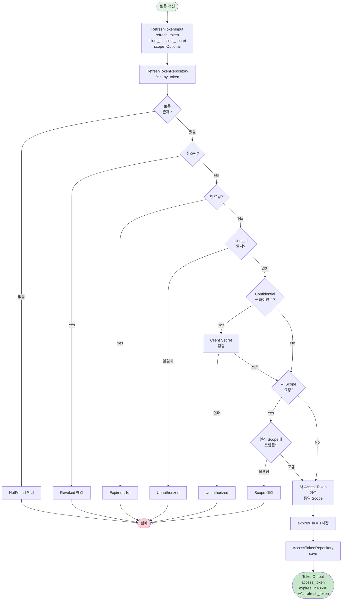
```mermaid
flowchart TD
    Start([토큰 갱신]) --> Input[RefreshTokenInput<br/>refresh_token<br/>client_id, client_secret<br/>scope=Optional]

    Input --> FindToken[RefreshTokenRepository<br/>find_by_token]
    FindToken --> TokenExists{토큰<br/>존재?}
    TokenExists -->|없음| NotFound[NotFound 에러]

    TokenExists -->|있음| CheckRevoked{취소됨?}
    CheckRevoked -->|Yes| Revoked[Revoked 에러]
    CheckRevoked -->|No| CheckExpired{만료됨?}

    CheckExpired -->|Yes| Expired[Expired 에러]
    CheckExpired -->|No| ValidateClient{client_id<br/>일치?}

    ValidateClient -->|불일치| Unauthorized[Unauthorized]
    ValidateClient -->|일치| CheckConfidential{Confidential<br/>클라이언트?}

    CheckConfidential -->|Yes| VerifySecret[Client Secret<br/>검증]
    VerifySecret -->|실패| SecretError[Unauthorized]
    VerifySecret -->|성공| CheckScope

    CheckConfidential -->|No| CheckScope{새 Scope<br/>요청?}

    CheckScope -->|Yes| ValidateScope{원래 Scope에<br/>포함됨?}
    ValidateScope -->|불포함| ScopeError[Scope 에러]
    ValidateScope -->|포함| GenerateAccess

    CheckScope -->|No| GenerateAccess[새 AccessToken<br/>생성<br/>동일 Scope]

    GenerateAccess --> SetExpiry[expires_in = 1시간]
    SetExpiry --> SaveToken[AccessTokenRepository<br/>save]
    SaveToken --> Success([TokenOutput<br/>access_token<br/>expires_in=3600<br/>동일 refresh_token])

    NotFound --> End([실패])
    Revoked --> End
    Expired --> End
    Unauthorized --> End
    SecretError --> End
    ScopeError --> End

    style Start fill:#e1f5e1
    style Success fill:#c8e6c9
    style End fill:#ffcdd2
```

**Scope 축소:**
- 새로운 Scope 요청 시 원래 Scope의 부분집합만 허용
- 예: 원래 "openid profile email" → 새로 "openid profile" 가능

**토큰 갱신 전략:**
- Access Token만 갱신
- Refresh Token은 재사용 (단순 갱신)
- 향후 Refresh Token Rotation 고려

---

### 4.3 토큰 취소

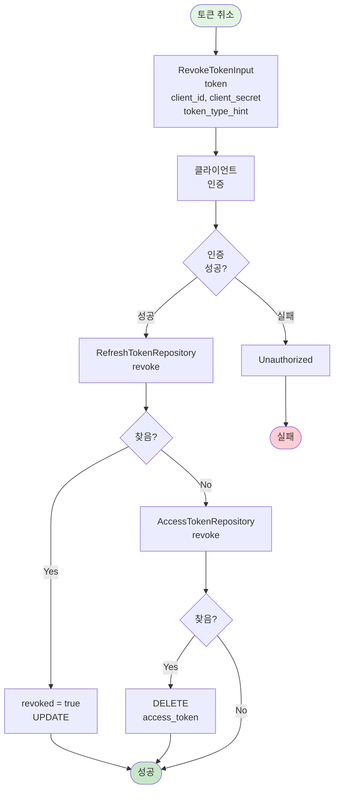
```mermaid
flowchart TD
    Start([토큰 취소]) --> Input[RevokeTokenInput<br/>token<br/>client_id, client_secret<br/>token_type_hint]

    Input --> AuthClient[클라이언트<br/>인증]
    AuthClient --> AuthSuccess{인증<br/>성공?}
    AuthSuccess -->|실패| Unauthorized[Unauthorized]

    AuthSuccess -->|성공| TryRefresh[RefreshTokenRepository<br/>revoke]
    TryRefresh --> RefreshFound{찾음?}

    RefreshFound -->|Yes| MarkRevoked[revoked = true<br/>UPDATE]
    MarkRevoked --> Success([성공])

    RefreshFound -->|No| TryAccess[AccessTokenRepository<br/>revoke]
    TryAccess --> AccessFound{찾음?}

    AccessFound -->|Yes| DeleteAccess[DELETE<br/>access_token]
    DeleteAccess --> Success

    AccessFound -->|No| Success

    Unauthorized --> End([실패])

    style Start fill:#e1f5e1
    style Success fill:#c8e6c9
    style End fill:#ffcdd2
```

**특징:**
- **Idempotent**: 토큰이 없어도 성공 반환
- Refresh Token: revoked 플래그 설정
- Access Token: 레코드 삭제

**RFC 7009 준수:**
- token_type_hint는 힌트일 뿐, 양쪽 다 확인
- 클라이언트 인증 필수

---

### 4.4 토큰 검증 (Introspection)

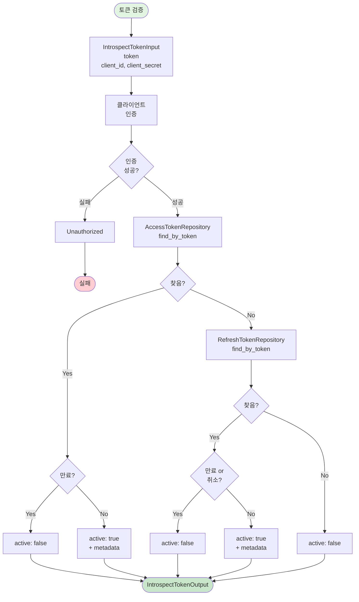
```mermaid
flowchart TD
    Start([토큰 검증]) --> Input[IntrospectTokenInput<br/>token<br/>client_id, client_secret]

    Input --> AuthClient[클라이언트<br/>인증]
    AuthClient --> AuthSuccess{인증<br/>성공?}
    AuthSuccess -->|실패| Unauthorized[Unauthorized]

    AuthSuccess -->|성공| TryAccess[AccessTokenRepository<br/>find_by_token]
    TryAccess --> AccessFound{찾음?}

    AccessFound -->|Yes| CheckAccessExpired{만료?}
    CheckAccessExpired -->|Yes| InactiveAccess[active: false]
    CheckAccessExpired -->|No| ActiveAccess[active: true<br/>+ metadata]
    ActiveAccess --> Success

    AccessFound -->|No| TryRefresh[RefreshTokenRepository<br/>find_by_token]
    TryRefresh --> RefreshFound{찾음?}

    RefreshFound -->|Yes| CheckRefreshStatus{만료 or<br/>취소?}
    CheckRefreshStatus -->|Yes| InactiveRefresh[active: false]
    CheckRefreshStatus -->|No| ActiveRefresh[active: true<br/>+ metadata]
    ActiveRefresh --> Success

    RefreshFound -->|No| NotFoundToken[active: false]

    InactiveAccess --> Success([IntrospectTokenOutput])
    InactiveRefresh --> Success
    NotFoundToken --> Success

    Unauthorized --> End([실패])

    style Start fill:#e1f5e1
    style Success fill:#c8e6c9
    style End fill:#ffcdd2
```

**응답 예시:**

```json
// Active Access Token
{
  "active": true,
  "scope": "openid profile email",
  "client_id": "client-uuid",
  "user_id": "user-uuid",
  "exp": 1737564000
}

// Inactive Token
{
  "active": false
}
```

---

## 컴포넌트 다이어그램

### 5.1 전체 시스템 아키텍처

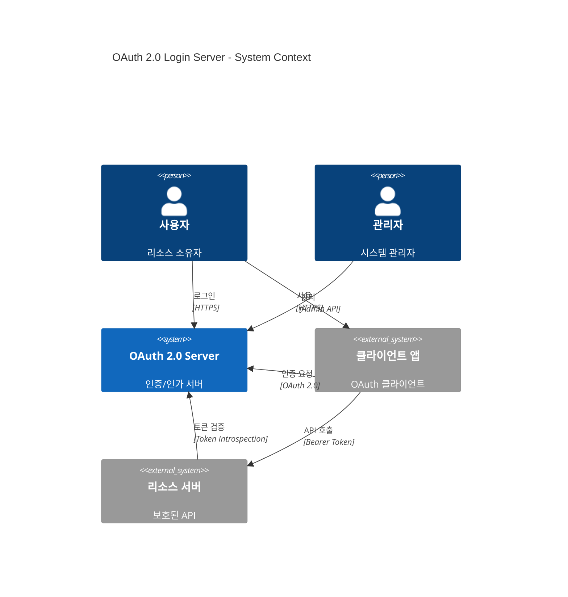
```mermaid
C4Context
    title OAuth 2.0 Login Server - System Context

    Person(user, "사용자", "리소스 소유자")
    Person(admin, "관리자", "시스템 관리자")

    System(oauth, "OAuth 2.0 Server", "인증/인가 서버")

    System_Ext(client_app, "클라이언트 앱", "OAuth 클라이언트")
    System_Ext(resource_server, "리소스 서버", "보호된 API")

    Rel(user, client_app, "사용", "HTTPS")
    Rel(client_app, oauth, "인증 요청", "OAuth 2.0")
    Rel(user, oauth, "로그인", "HTTPS")
    Rel(client_app, resource_server, "API 호출", "Bearer Token")
    Rel(resource_server, oauth, "토큰 검증", "Token Introspection")
    Rel(admin, oauth, "관리", "Admin API")
```

---

### 5.2 레이어별 컴포넌트

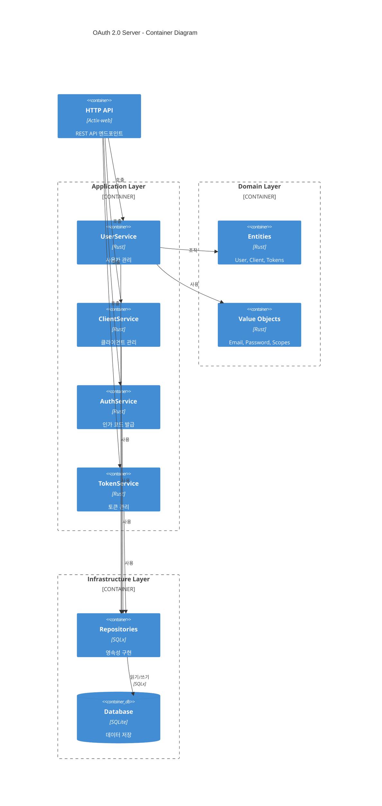
```mermaid
C4Container
    title OAuth 2.0 Server - Container Diagram

    Container(api, "HTTP API", "Actix-web", "REST API 엔드포인트")

    Container_Boundary(app, "Application Layer") {
        Container(user_svc, "UserService", "Rust", "사용자 관리")
        Container(client_svc, "ClientService", "Rust", "클라이언트 관리")
        Container(auth_svc, "AuthService", "Rust", "인가 코드 발급")
        Container(token_svc, "TokenService", "Rust", "토큰 관리")
    }

    Container_Boundary(domain, "Domain Layer") {
        Container(entities, "Entities", "Rust", "User, Client, Tokens")
        Container(vos, "Value Objects", "Rust", "Email, Password, Scopes")
    }

    Container_Boundary(infra, "Infrastructure Layer") {
        Container(repos, "Repositories", "SQLx", "영속성 구현")
        ContainerDb(db, "Database", "SQLite", "데이터 저장")
    }

    Rel(api, user_svc, "호출")
    Rel(api, client_svc, "호출")
    Rel(api, auth_svc, "호출")
    Rel(api, token_svc, "호출")

    Rel(user_svc, repos, "사용")
    Rel(client_svc, repos, "사용")
    Rel(auth_svc, repos, "사용")
    Rel(token_svc, repos, "사용")

    Rel(user_svc, entities, "조작")
    Rel(user_svc, vos, "사용")
    Rel(repos, db, "읽기/쓰기", "SQLx")
```

---

## 시퀀스 다이어그램

### 6.1 사용자 등록 및 인증 시퀀스

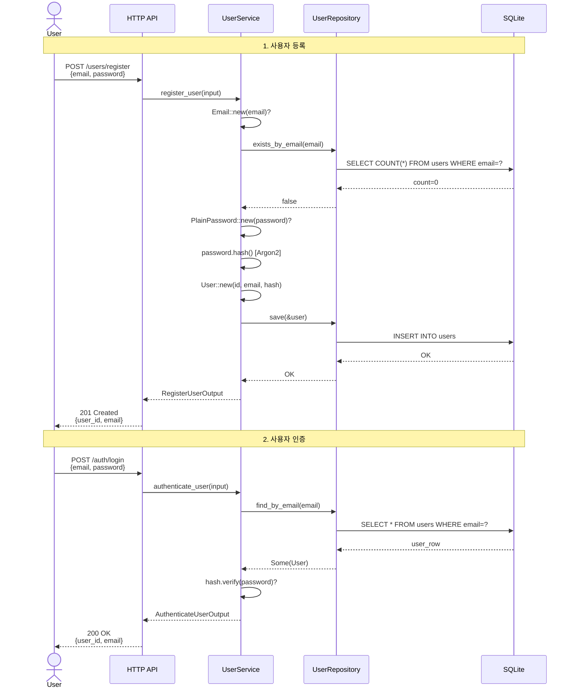
```mermaid
sequenceDiagram
    actor User
    participant API as HTTP API
    participant UserSvc as UserService
    participant UserRepo as UserRepository
    participant DB as SQLite

    Note over User,DB: 1. 사용자 등록
    User->>API: POST /users/register<br/>{email, password}
    API->>UserSvc: register_user(input)

    UserSvc->>UserSvc: Email::new(email)?
    UserSvc->>UserRepo: exists_by_email(email)
    UserRepo->>DB: SELECT COUNT(*) FROM users WHERE email=?
    DB-->>UserRepo: count=0
    UserRepo-->>UserSvc: false

    UserSvc->>UserSvc: PlainPassword::new(password)?
    UserSvc->>UserSvc: password.hash() [Argon2]
    UserSvc->>UserSvc: User::new(id, email, hash)

    UserSvc->>UserRepo: save(&user)
    UserRepo->>DB: INSERT INTO users
    DB-->>UserRepo: OK
    UserRepo-->>UserSvc: OK

    UserSvc-->>API: RegisterUserOutput
    API-->>User: 201 Created<br/>{user_id, email}

    Note over User,DB: 2. 사용자 인증
    User->>API: POST /auth/login<br/>{email, password}
    API->>UserSvc: authenticate_user(input)

    UserSvc->>UserRepo: find_by_email(email)
    UserRepo->>DB: SELECT * FROM users WHERE email=?
    DB-->>UserRepo: user_row
    UserRepo-->>UserSvc: Some(User)

    UserSvc->>UserSvc: hash.verify(password)?
    UserSvc-->>API: AuthenticateUserOutput
    API-->>User: 200 OK<br/>{user_id, email}
```

---

### 6.2 OAuth 인가 코드 플로우 (Full)

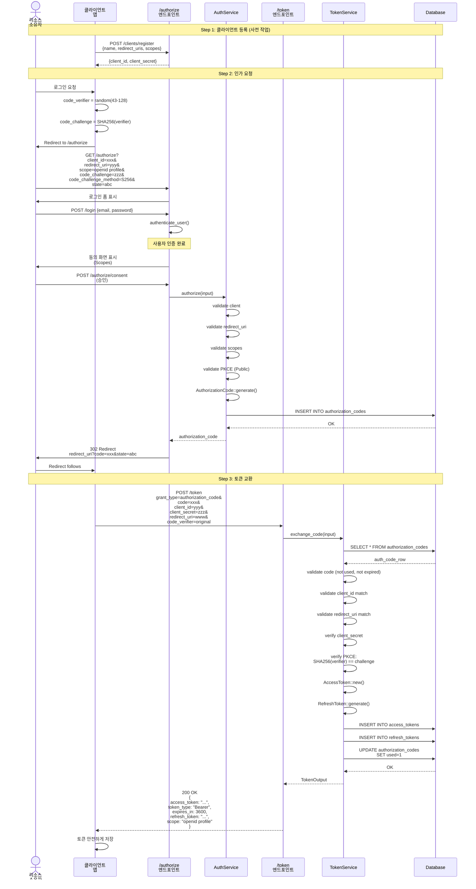
```mermaid
sequenceDiagram
    actor User as 리소스<br/>소유자
    participant Client as 클라이언트<br/>앱
    participant AuthAPI as /authorize<br/>엔드포인트
    participant AuthSvc as AuthService
    participant TokenAPI as /token<br/>엔드포인트
    participant TokenSvc as TokenService
    participant DB as Database

    Note over User,DB: Step 1: 클라이언트 등록 (사전 작업)
    Client->>AuthAPI: POST /clients/register<br/>{name, redirect_uris, scopes}
    AuthAPI-->>Client: {client_id, client_secret}

    Note over User,DB: Step 2: 인가 요청
    User->>Client: 로그인 요청
    Client->>Client: code_verifier = random(43-128)
    Client->>Client: code_challenge = SHA256(verifier)

    Client->>User: Redirect to /authorize
    User->>AuthAPI: GET /authorize?<br/>client_id=xxx&<br/>redirect_uri=yyy&<br/>scope=openid profile&<br/>code_challenge=zzz&<br/>code_challenge_method=S256&<br/>state=abc

    AuthAPI->>User: 로그인 폼 표시
    User->>AuthAPI: POST /login {email, password}
    AuthAPI->>AuthAPI: authenticate_user()

    Note over AuthAPI: 사용자 인증 완료

    AuthAPI->>User: 동의 화면 표시<br/>(Scopes)
    User->>AuthAPI: POST /authorize/consent<br/>(승인)

    AuthAPI->>AuthSvc: authorize(input)
    AuthSvc->>AuthSvc: validate client
    AuthSvc->>AuthSvc: validate redirect_uri
    AuthSvc->>AuthSvc: validate scopes
    AuthSvc->>AuthSvc: validate PKCE (Public)

    AuthSvc->>AuthSvc: AuthorizationCode::generate()
    AuthSvc->>DB: INSERT INTO authorization_codes
    DB-->>AuthSvc: OK

    AuthSvc-->>AuthAPI: authorization_code
    AuthAPI->>User: 302 Redirect<br/>redirect_uri?code=xxx&state=abc
    User->>Client: Redirect follows

    Note over User,DB: Step 3: 토큰 교환
    Client->>TokenAPI: POST /token<br/>grant_type=authorization_code&<br/>code=xxx&<br/>client_id=yyy&<br/>client_secret=zzz&<br/>redirect_uri=www&<br/>code_verifier=original

    TokenAPI->>TokenSvc: exchange_code(input)
    TokenSvc->>DB: SELECT * FROM authorization_codes
    DB-->>TokenSvc: auth_code_row

    TokenSvc->>TokenSvc: validate code (not used, not expired)
    TokenSvc->>TokenSvc: validate client_id match
    TokenSvc->>TokenSvc: validate redirect_uri match
    TokenSvc->>TokenSvc: verify client_secret
    TokenSvc->>TokenSvc: verify PKCE:<br/>SHA256(verifier) == challenge

    TokenSvc->>TokenSvc: AccessToken::new()
    TokenSvc->>TokenSvc: RefreshToken::generate()

    TokenSvc->>DB: INSERT INTO access_tokens
    TokenSvc->>DB: INSERT INTO refresh_tokens
    TokenSvc->>DB: UPDATE authorization_codes<br/>SET used=1
    DB-->>TokenSvc: OK

    TokenSvc-->>TokenAPI: TokenOutput
    TokenAPI-->>Client: 200 OK<br/>{<br/>  access_token: "...",<br/>  token_type: "Bearer",<br/>  expires_in: 3600,<br/>  refresh_token: "...",<br/>  scope: "openid profile"<br/>}

    Client->>Client: 토큰 안전하게 저장
```

---

### 6.3 토큰 갱신 시퀀스

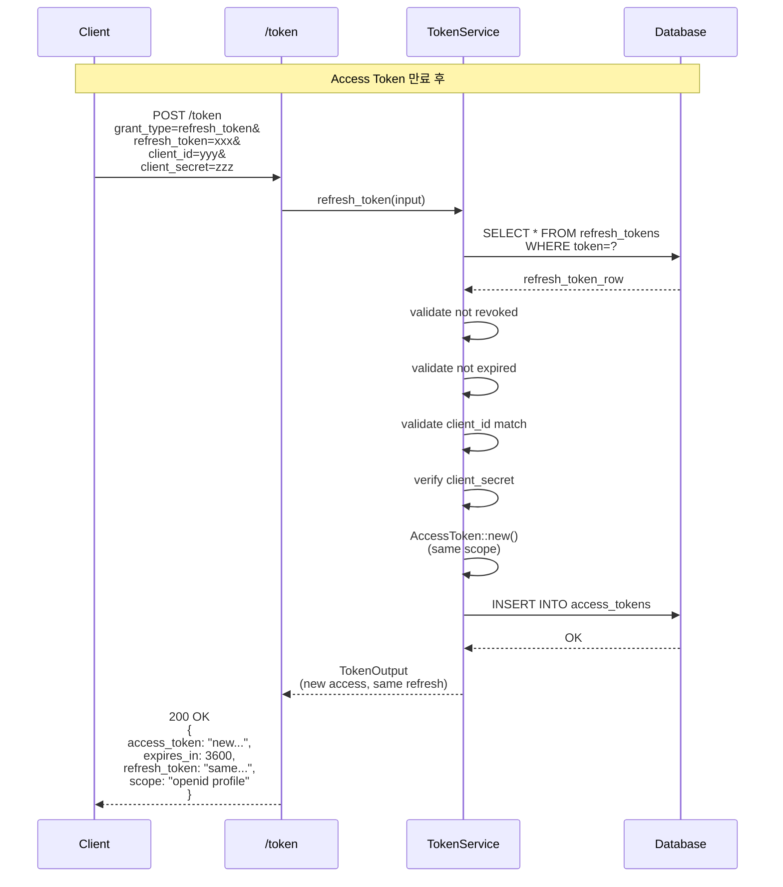
```mermaid
sequenceDiagram
    participant Client
    participant TokenAPI as /token
    participant TokenSvc as TokenService
    participant DB as Database

    Note over Client,DB: Access Token 만료 후

    Client->>TokenAPI: POST /token<br/>grant_type=refresh_token&<br/>refresh_token=xxx&<br/>client_id=yyy&<br/>client_secret=zzz

    TokenAPI->>TokenSvc: refresh_token(input)

    TokenSvc->>DB: SELECT * FROM refresh_tokens<br/>WHERE token=?
    DB-->>TokenSvc: refresh_token_row

    TokenSvc->>TokenSvc: validate not revoked
    TokenSvc->>TokenSvc: validate not expired
    TokenSvc->>TokenSvc: validate client_id match
    TokenSvc->>TokenSvc: verify client_secret

    TokenSvc->>TokenSvc: AccessToken::new()<br/>(same scope)

    TokenSvc->>DB: INSERT INTO access_tokens
    DB-->>TokenSvc: OK

    TokenSvc-->>TokenAPI: TokenOutput<br/>(new access, same refresh)
    TokenAPI-->>Client: 200 OK<br/>{<br/>  access_token: "new...",<br/>  expires_in: 3600,<br/>  refresh_token: "same...",<br/>  scope: "openid profile"<br/>}
```

---

### 6.4 토큰 취소 시퀀스

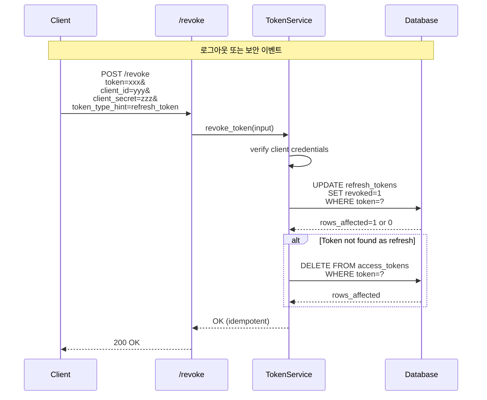
```mermaid
sequenceDiagram
    participant Client
    participant RevokeAPI as /revoke
    participant TokenSvc as TokenService
    participant DB as Database

    Note over Client,DB: 로그아웃 또는 보안 이벤트

    Client->>RevokeAPI: POST /revoke<br/>token=xxx&<br/>client_id=yyy&<br/>client_secret=zzz&<br/>token_type_hint=refresh_token

    RevokeAPI->>TokenSvc: revoke_token(input)

    TokenSvc->>TokenSvc: verify client credentials

    TokenSvc->>DB: UPDATE refresh_tokens<br/>SET revoked=1<br/>WHERE token=?
    DB-->>TokenSvc: rows_affected=1 or 0

    alt Token not found as refresh
        TokenSvc->>DB: DELETE FROM access_tokens<br/>WHERE token=?
        DB-->>TokenSvc: rows_affected
    end

    TokenSvc-->>RevokeAPI: OK (idempotent)
    RevokeAPI-->>Client: 200 OK
```

---

### 6.5 토큰 검증 시퀀스

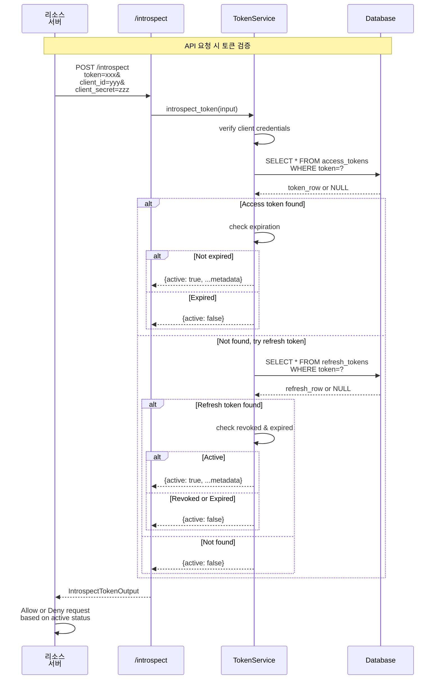
```mermaid
sequenceDiagram
    participant ResourceServer as 리소스<br/>서버
    participant IntrospectAPI as /introspect
    participant TokenSvc as TokenService
    participant DB as Database

    Note over ResourceServer,DB: API 요청 시 토큰 검증

    ResourceServer->>IntrospectAPI: POST /introspect<br/>token=xxx&<br/>client_id=yyy&<br/>client_secret=zzz

    IntrospectAPI->>TokenSvc: introspect_token(input)

    TokenSvc->>TokenSvc: verify client credentials

    TokenSvc->>DB: SELECT * FROM access_tokens<br/>WHERE token=?
    DB-->>TokenSvc: token_row or NULL

    alt Access token found
        TokenSvc->>TokenSvc: check expiration
        alt Not expired
            TokenSvc-->>IntrospectAPI: {active: true, ...metadata}
        else Expired
            TokenSvc-->>IntrospectAPI: {active: false}
        end
    else Not found, try refresh token
        TokenSvc->>DB: SELECT * FROM refresh_tokens<br/>WHERE token=?
        DB-->>TokenSvc: refresh_row or NULL

        alt Refresh token found
            TokenSvc->>TokenSvc: check revoked & expired
            alt Active
                TokenSvc-->>IntrospectAPI: {active: true, ...metadata}
            else Revoked or Expired
                TokenSvc-->>IntrospectAPI: {active: false}
            end
        else Not found
            TokenSvc-->>IntrospectAPI: {active: false}
        end
    end

    IntrospectAPI-->>ResourceServer: IntrospectTokenOutput

    ResourceServer->>ResourceServer: Allow or Deny request<br/>based on active status
```

---

## 에러 처리 플로우

### 7.1 에러 전파 체인

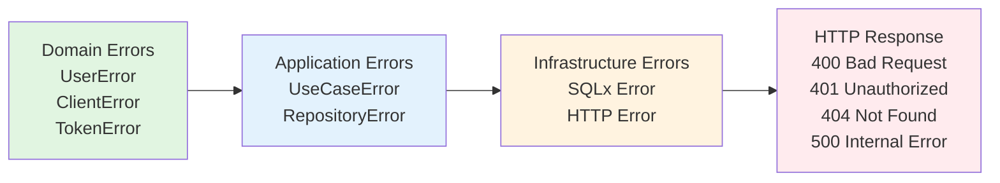
```mermaid
flowchart LR
    Domain[Domain Errors<br/>UserError<br/>ClientError<br/>TokenError] --> Application[Application Errors<br/>UseCaseError<br/>RepositoryError]

    Application --> Infrastructure[Infrastructure Errors<br/>SQLx Error<br/>HTTP Error]

    Infrastructure --> HTTP[HTTP Response<br/>400 Bad Request<br/>401 Unauthorized<br/>404 Not Found<br/>500 Internal Error]

    style Domain fill:#e1f5e1
    style Application fill:#e3f2fd
    style Infrastructure fill:#fff3e0
    style HTTP fill:#ffebee
```

**에러 매핑:**

| Domain Error | Use Case Error | HTTP Status |
|--------------|----------------|-------------|
| EmailError::Invalid | Validation | 400 |
| UserError::NotFound | NotFound | 404 |
| UserError::InvalidCredentials | Unauthorized | 401 |
| ClientError::InvalidClientSecret | Unauthorized | 401 |
| AuthCodeError::Expired | Validation | 400 |
| TokenError::Revoked | Unauthorized | 401 |
| RepositoryError::Database | Internal | 500 |

---

## 데이터베이스 트랜잭션 플로우

### 8.1 토큰 교환 트랜잭션

```mermaid
flowchart TD
    Start([BEGIN TRANSACTION]) --> Read1[SELECT authorization_code]
    Read1 --> Read2[SELECT oauth_client]
    Read2 --> Validate[Validate all conditions]

    Validate --> Write1[INSERT access_token]
    Write1 --> Write2[INSERT refresh_token]
    Write2 --> Write3[UPDATE authorization_code<br/>SET used=1]

    Write3 --> Commit{All<br/>successful?}
    Commit -->|Yes| CommitTx[COMMIT]
    Commit -->|No| Rollback[ROLLBACK]

    CommitTx --> Success([Success])
    Rollback --> Error([Error])

    style Start fill:#e1f5e1
    style Success fill:#c8e6c9
    style Error fill:#ffcdd2
```

**ACID 속성:**
- **Atomicity**: 모든 작업이 성공하거나 모두 실패
- **Consistency**: 외래 키 제약조건 유지
- **Isolation**: READ COMMITTED (SQLite 기본)
- **Durability**: WAL 모드 사용

---

## 성능 최적화 포인트

### 9.1 쿼리 최적화

```mermaid
flowchart LR
    subgraph "Without Index"
        Query1[SELECT * FROM users<br/>WHERE email=?] --> Scan1[Full Table Scan<br/>O n]
    end

    subgraph "With Index"
        Query2[SELECT * FROM users<br/>WHERE email=?] --> Index[B-Tree Index Lookup<br/>O log n]
    end

    style Scan1 fill:#ffcdd2
    style Index fill:#c8e6c9
```

**인덱스 전략:**
- `users.email`: 로그인 시 빠른 조회
- `authorization_codes.expires_at`: 만료 코드 정리
- `access_tokens.user_id`: 사용자별 토큰 조회
- `refresh_tokens.revoked`: 활성 토큰만 필터링

---

## 보안 위협 모델

### 10.1 위협 및 대응

```mermaid
mindmap
  root((OAuth 2.0<br/>위협))
    인증
      Credential Stuffing
        Rate Limiting
        Account Lockout
      Brute Force
        Argon2 Slow Hashing
        Attempt Throttling
      Phishing
        User Education
        MFA 향후
    인가
      Authorization Code Interception
        PKCE Mandatory for Public
        HTTPS Only
      Redirect URI Manipulation
        Exact Match Only
        No Wildcards
      Scope Escalation
        Strict Validation
        Allowed Scopes Check
    토큰
      Token Theft
        Short Expiration
        Secure Storage
      Token Replay
        One-time Auth Codes
        Revocation Support
      Token Leakage
        HTTPS Only
        No Logs
```

---

**문서 버전**: 1.0
**최종 수정**: 2025-01-22
**생성**: Claude Code + Mermaid Diagrams
